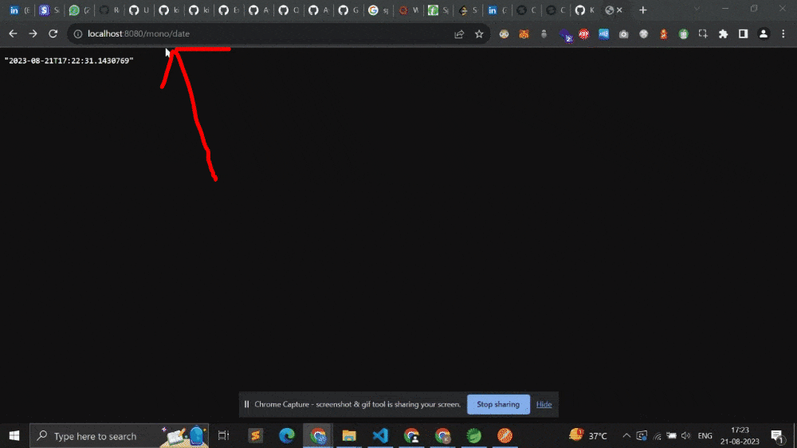
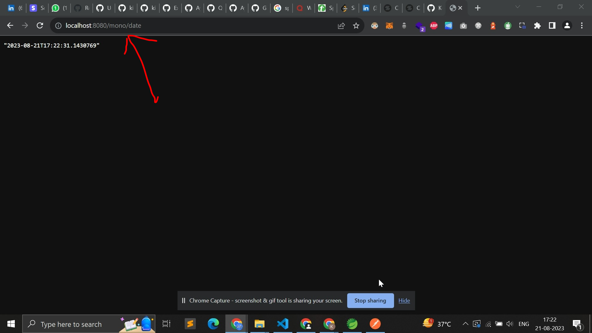
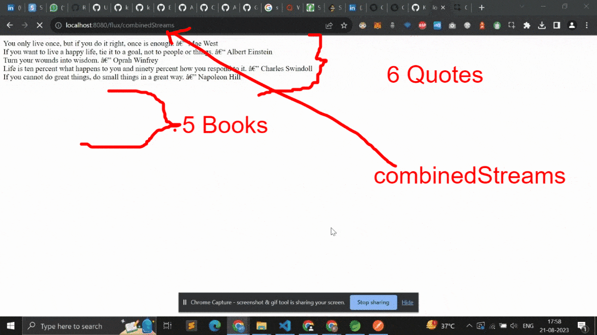
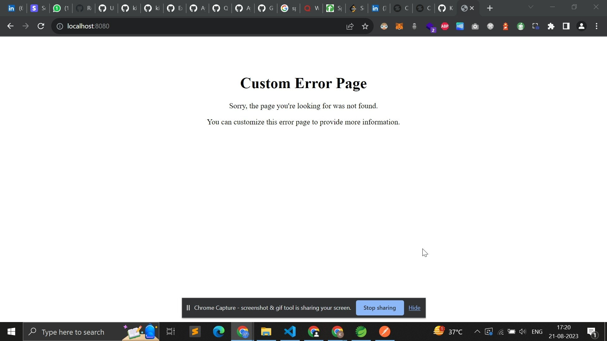

# Screenshots (Wait for 7-8 PNG files to load)







# Web-Flux & Mono Tutorials

This app gives <b>Flux and Mono</b> data from <b>HashMap</b> present in ./src/main/java/com/example/myWebFluxSSEApp/Data/ReactiveDataUtil.java and shows it in Flux and Mono. I have also <b>i. combined flux & ii. filtered & mapped flux</b>.

# Resources

1. https://www.baeldung.com/java-reactor-flux-vs-mono
2. Java Brains

# Mono

Mono is a special type of Publisher. A Mono object represents a single or empty value.
This means it can emit only one value at most for the onNext() request and then terminates

# Flux

Flux is a standard Publisher that represents 0 to N asynchronous sequence values. This means that it can emit 0 to many values, possibly infinite values for onNext() requests, and then terminates with either a completion or an error signal.

Mono and Flux are both implementations of the Publisher interface.

# Producer

In the context of reactive programming, a producer is a source of data that emits items asynchronously over time. It generates data and pushes it to consumers. For example, in the context of reactive streams, a producer could be a Flux that emits a sequence of items.

# Consumer

A consumer is a component that subscribes to a producer to receive and process the data it emits. It reacts to the data as it arrives. In reactive programming, a consumer is also referred to as a subscriber. It specifies what to do with the data and handles backpressure if the producer emits data faster than the consumer can process.

# Iterate

In the context of reactive programming, "iterate" generally refers to the process of sequentially processing items emitted by a producer using a consumer. It involves subscribing to a producer and reacting to each emitted item by performing some operation.

Here's a brief example of how these concepts could be applied in a reactive programming scenario using Spring WebFlux:

```
Flux<Integer> producer = Flux.range(1, 10); // A producer that emits numbers from 1 to 10

Consumer<Integer> consumer = item -> {
    // Process each emitted item (number) here
    System.out.println("Received: " + item);
};

producer.subscribe(consumer); // Subscribe the consumer to the producer
```

In this example, producer is a source of data emitting numbers, and consumer is processing each emitted number. The subscribe method connects the producer with the consumer, initiating the flow of data.

Reactive programming focuses on handling asynchronous data streams, and the concepts of producers and consumers are fundamental to this paradigm. By using reactive constructs like Flux and Mono, you can build efficient and responsive applications that deal with asynchronous and event-driven scenarios.
