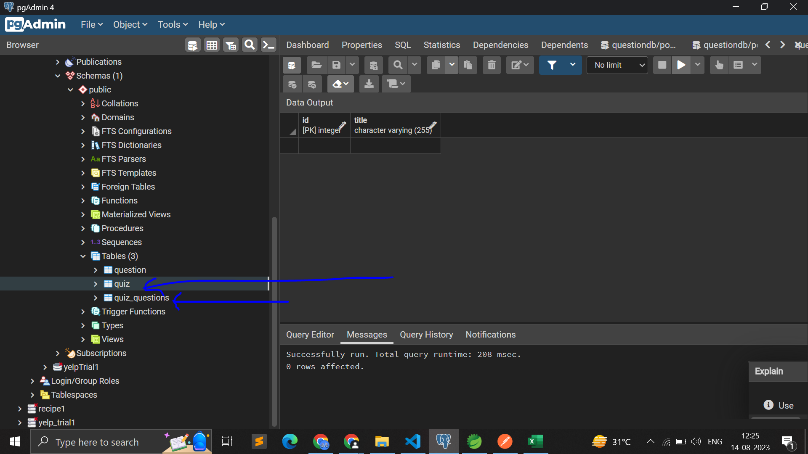
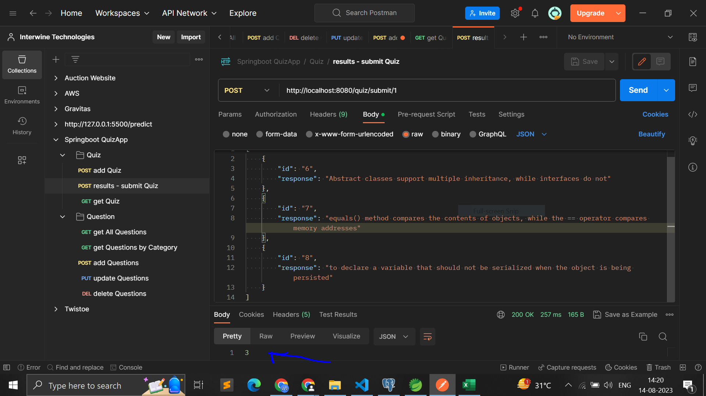
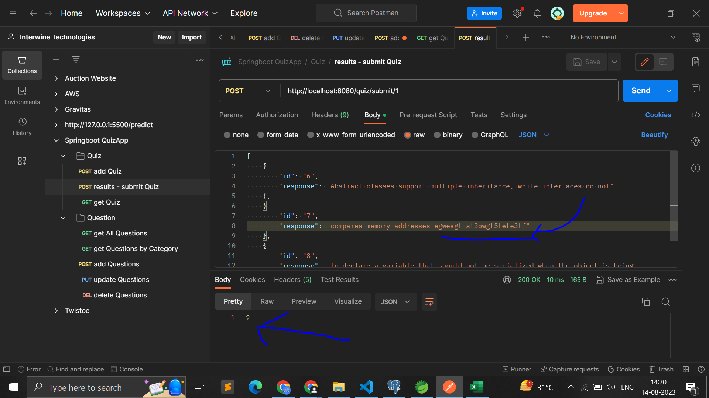
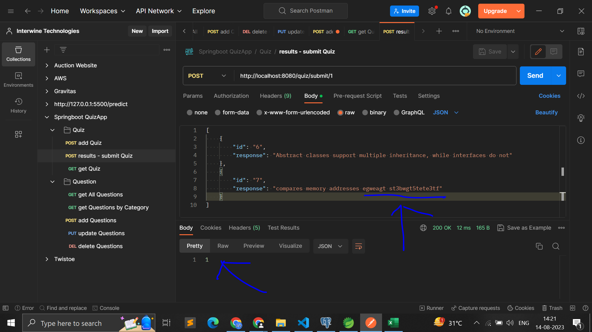

# PORTS 
- API Gateway : 8765, 
- QUESTION-SERVICE : 8081, 
- QUIZ-SERVICE : 8090, 
- SERVICE-REGISTRY : 8761

# Screenshots (Wait for 5-10 PNG screenshot files to load)

run configurations->arguments tab->-Dserver.port=8081" >

   

# APIs

To get APIs in json format for Postman, go to folder /01.QuizApp/PostmanAPIExportedHere

# Resources

1. Spring Boot Project for Beginners - https://www.youtube.com/watch?v=vlz9ina4Usk

# Show your support

Give a star(⭐️) if this project helped you!

## Contributors 😎

  

<!--  
Make sure to credit me in the Footer, if you do end up using it! -->
