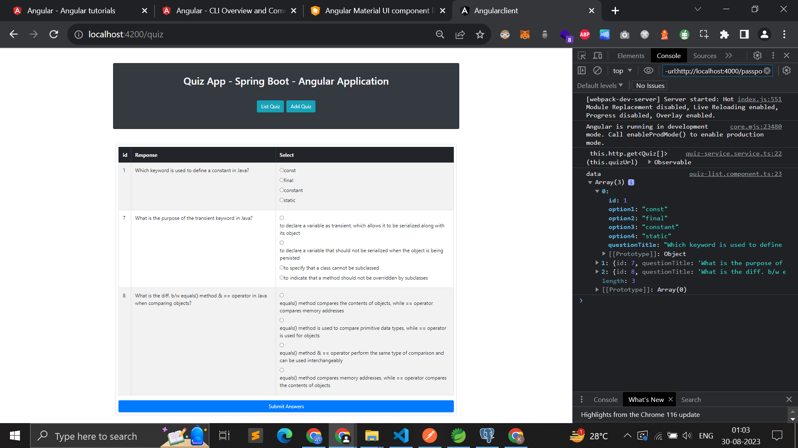
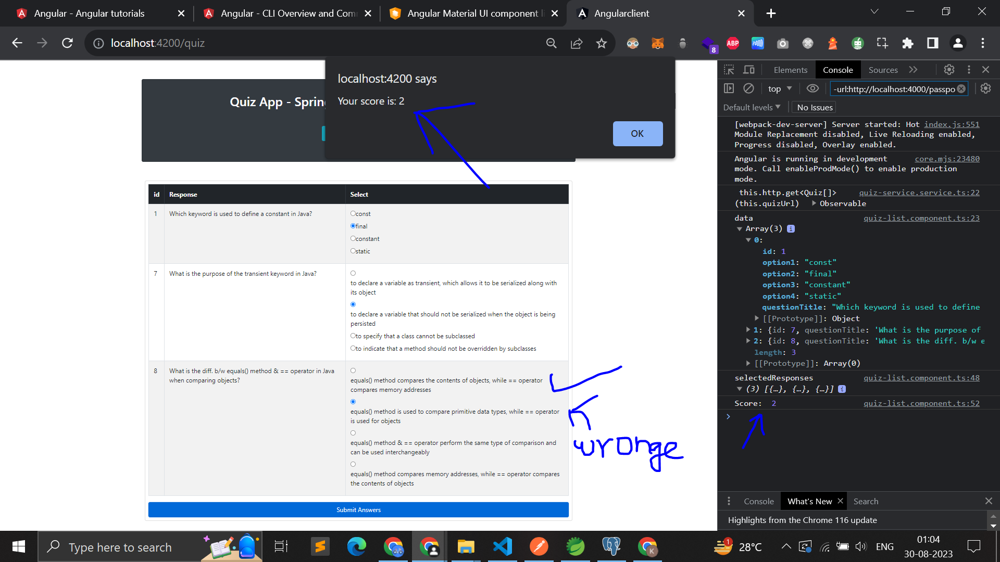
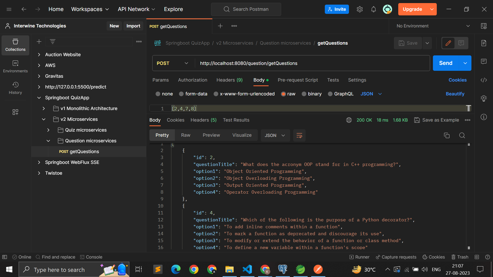
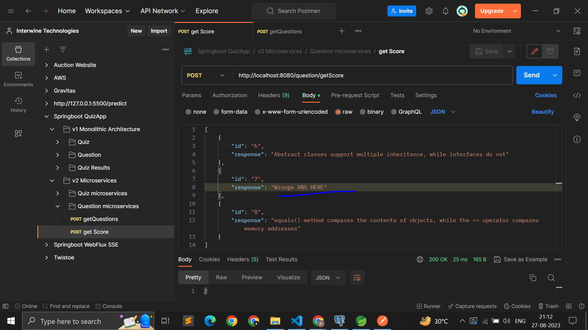
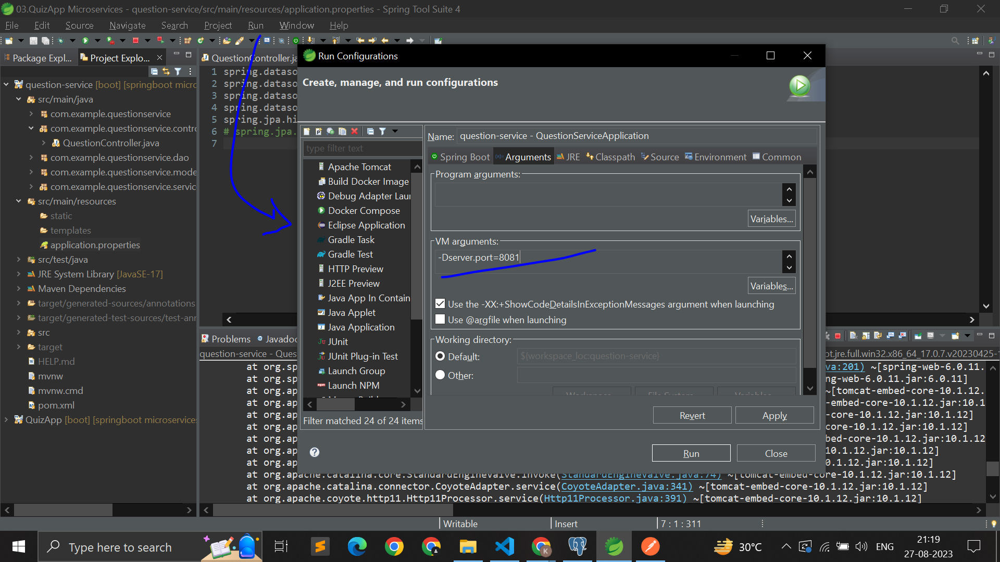
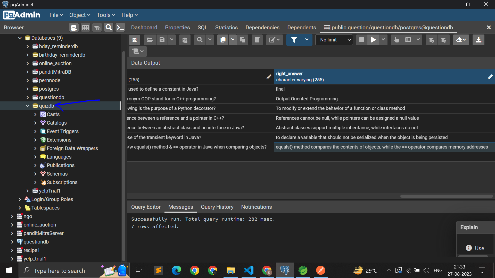
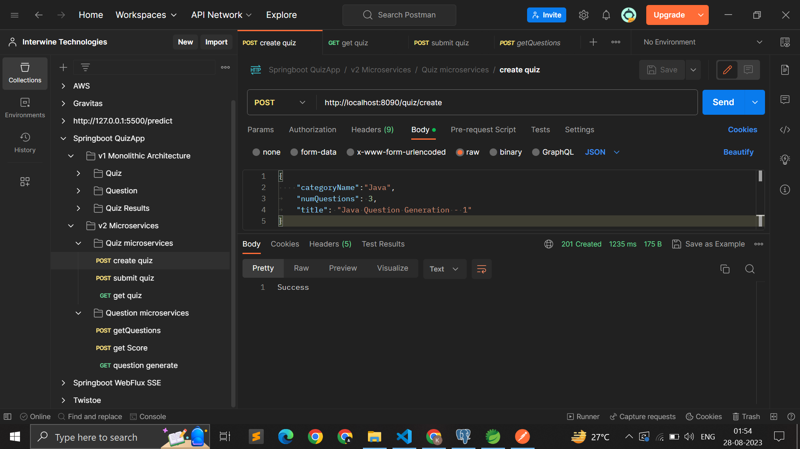
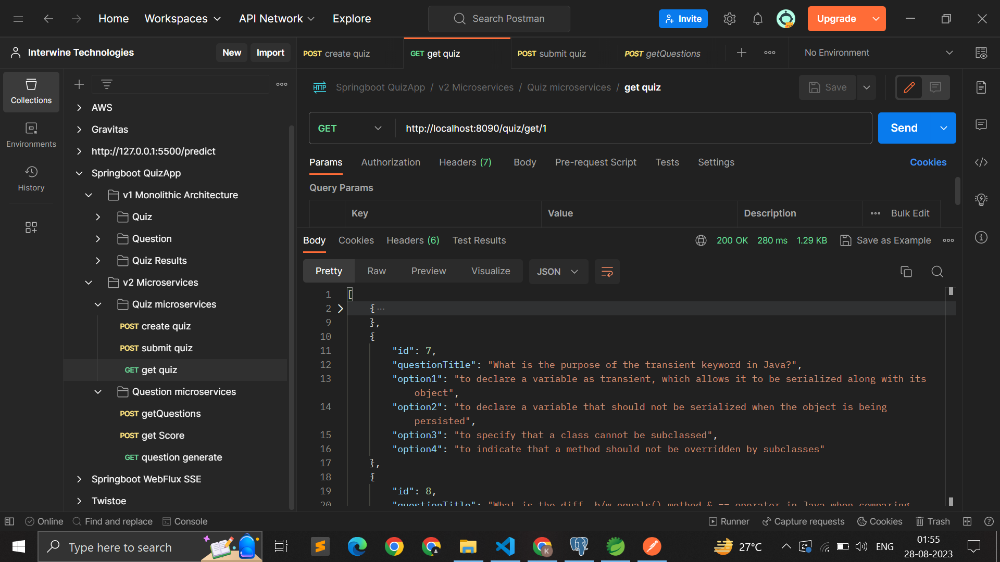
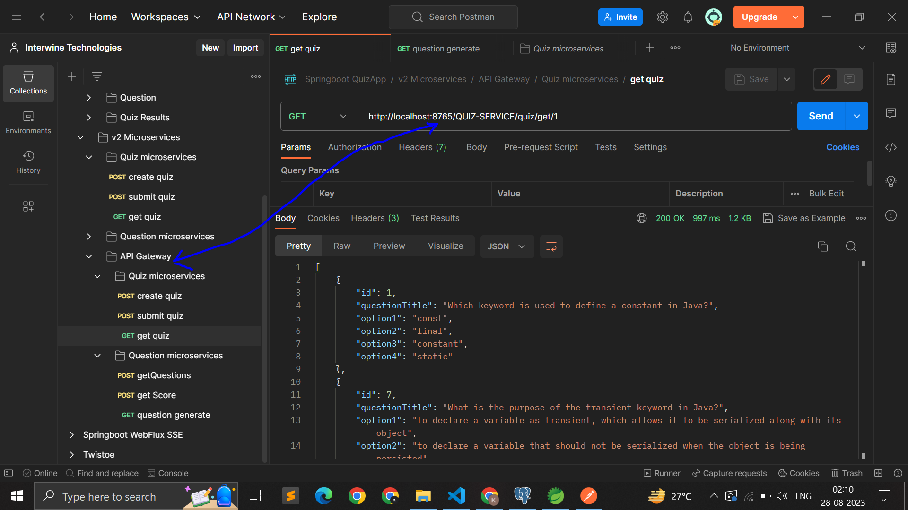

# PORTS

- API Gateway : 8765,
- QUESTION-SERVICE : 8080, (Add -Dserver.port=8080 in right click on qn service/run-as/run-configurations/arguments tab/ VM arguments)
<!-- - QUIZ-SERVICE : 8090, -->
- QUIZ-SERVICE : 8081,
- SERVICE-REGISTRY : 8761

# Screenshots (Wait for 5-10 PNG screenshot files to load)

run configurations->arguments tab->-Dserver.port=8081" >

   
   

# APIs

To get APIs in json format for Postman, go to folder ./PostmanAPIExportedHere

# Resources

1. Spring Boot Project for Beginners - https://www.youtube.com/watch?v=vlz9ina4Usk

# Show your support

Give a star(⭐️) if this project helped you!

## Contributors 😎

  

<!--  
Make sure to credit me in the Footer, if you do end up using it! -->
