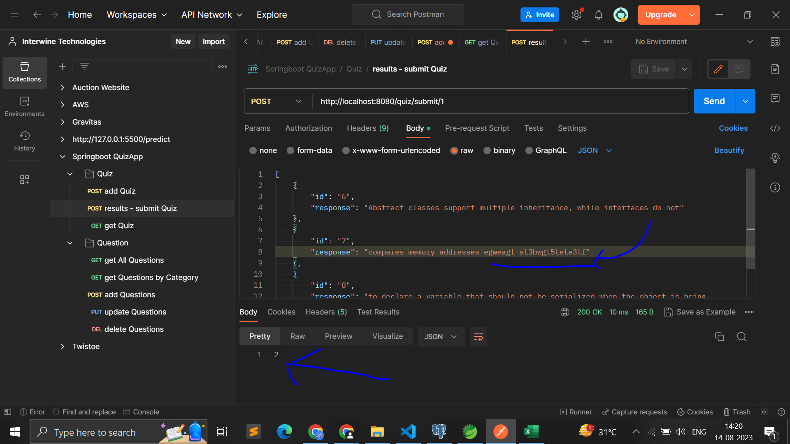

# Screenshots (Wait for 5-10 PNG screenshot files to load)

   

# APIs

To get APIs in json format for Postman, go to folder /01.QuizApp/PostmanAPIExportedHere

# Resources

1. Spring Boot Project for Beginners - https://www.youtube.com/watch?v=vlz9ina4Usk

# Show your support

Give a star(⭐️) if this project helped you!

## Contributors 😎

  

<!--  
Make sure to credit me in the Footer, if you do end up using it! -->
